<!-- ╔═══════════════════════════════════════════════════════════════════╗
     ║                David Banda — GitHub Profile README                ║
     ╚═══════════════════════════════════════════════════════════════════╝ -->

  

<!-- Quick stat row -->

  
  
  
  
  

---

## 🎯 Sobre mí

Administrador de **sistemas e infraestructura** en Webdreams. Levanto y mantengo servidores
Linux/Windows, gestiono el **correo corporativo (Zimbra)** con SPF/DKIM/DMARC, monitorizo con
**Grafana y Zabbix**, renuevo certificados y hago **hardening**.

Sobre esa base voy sumando capas: **automatización low-code**, **agentes IA**, bases de datos
y **backend a medida** cuando necesito una herramienta que no existe.

> ⚡ Sysadmin de profesión. Dev por necesidad y curiosidad. **Aprendo construyendo, no copiando.**

---

## 🚀 Stack

  
  
  
  
  
  
  
  

| Área | Herramientas |
|:--|:--|
| 🖥️ **Sistemas** · *mi base* | Linux · Windows Server · Docker · Nginx · Caddy · Let's Encrypt · SSH · Bash · PowerShell |
| 📧 **Correo** | Zimbra · IMAP/SMTP · SPF · DKIM · DMARC |
| 📊 **Monitorización** | Grafana · Zabbix · Prometheus |
| 🛡️ **Seguridad** | Hardening · Pentesting · Kali · 2FA TOTP · Fernet · JWT · RBAC · Audit logs |
| 🗄️ **Datos** | SQL Server · PostgreSQL · SQLite · Redis · Prisma |
| ⚙️ **Automatización** | n8n · Make · Zapier · Webhooks |
| 🤖 **IA / LLMs** | OpenAI · Anthropic · Mistral · Flowise · LangChain |
| 💻 **Desarrollo** | Python · TypeScript · JavaScript · Java · FastAPI · Next.js · React · Tailwind |

---

## ⚡ Proyectos destacados

> Privados, bajo licencia propietaria. Disponibles bajo NDA o consulta directa.

<table>
<tr>
<td width="50%" valign="top">

### 🟣 Multi-tenant SQL Chat Platform v2
Chat SQL multi-tenant con widgets embebibles, 2FA TOTP, RBAC y multi-proveedor IA. Validación AST y audit logs cifrados.

`FastAPI` `React` `sqlglot` `Fernet` `JWT`

</td>
<td width="50%" valign="top">

### 🟢 B2B Leads Search Dashboard
Generación de leads B2B con scoring por IA. Self-hosted con Docker Compose, SSL automático e integración con SQL Server.

`Next.js` `Prisma` `Docker` `Redis`

</td>
</tr>
<tr>
<td width="50%" valign="top">

### 🟠 Cyber Audit Dashboard
Escritorio para sysadmin y seguridad. Análisis IA con Mistral, caché TTL y heurística anti-comandos peligrosos.

`PyQt` `Mistral` `Python`

</td>
<td width="50%" valign="top">

### ⏻ ApagarPC
Programa el apagado de Windows con animación circular en Tkinter. Cero dependencias externas.

`Python` `Tkinter` `Zero deps`

</td>
</tr>
</table>

---

## 🤖 Automatizaciones en producción

Flujos self-hosted que integran correo corporativo, SQL Server, webhooks y APIs propias.

| Workflow | Trigger | Qué hace |
|:--|:--|:--|
| **Email → Database Ingestor** | `IMAP` | Normaliza correos entrantes y los persiste con ramificación por remitente |
| **Monthly Report Generator** | `Cron` | Consulta la BD, compone el informe HTML y lo envía |
| **B2B Campaign Orchestrator** | `Schedule` | Trocea audiencia, dispara HTTP y envía con lógica condicional |
| **Inbound Reply Classifier** | `IMAP` | Clasifica respuestas por intención y notifica al sistema |
| **Outreach Webhook** | `Webhook` | Endpoint que dispara emails de outreach con validación previa |

> Aprendo en abierto: cada proyecto es una excusa para probar una herramienta nueva en serio.

---

## 📊 Actividad

  

  
  

---

## 🤝 Contacto

Para colaboraciones, contratación o licencias de proyectos privados:

